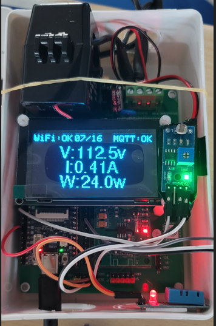
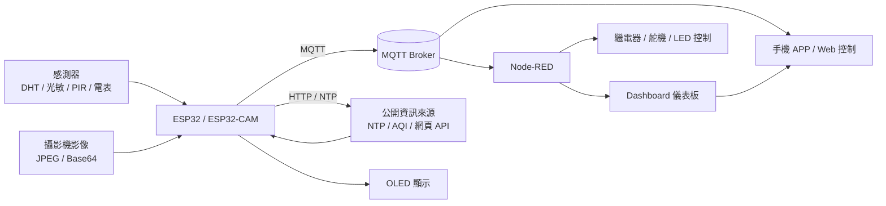

# esp32-mqtt-energy-meter

作者：富貴

這是一個以 **ESP32 / ESP32-CAM / MQTT / Node-RED / OLED / 感測器 / 智慧電表** 為主軸整理出的專題成果倉庫。  
內容涵蓋從基礎 GPIO、RGB LED、PIR 感測、OLED 顯示、Wi-Fi / NTP / HTTP、MQTT 通訊，到即時影像、智慧電表、Node-RED 儀表板與手機 APP 互動控制的完整流程。

本倉庫的目的有三個：

1. 保存目前專案的核心程式碼與成果文件。
2. 讓閱讀者可以快速理解各模組之間的關係。
3. 作為後續期末報告、教學展示與專題發表的版本基礎。

## 成果照片



## 專案重點

- ESP32 基礎控制：LED、WS2812、RGB LED、PIR 感測。
- OLED 顯示：使用 U8g2 / Adafruit_SSD1306 顯示文字、圖示與狀態資訊。
- 網路通訊：Wi-Fi 連線、NTP 校時、HTTP 取得公開資訊。
- MQTT 應用：將感測資料上傳到 Broker，並接收手機 APP 或 Node-RED 的控制指令。
- 環境監測：整合溫溼度、光線、公開空氣品質等資訊。
- 即時影像：ESP32-CAM 擷取影像並透過 MQTT 上傳。
- 智慧電表：整合 PZEM 類型電表資料、繼電器控制與儀表板呈現。
- Node-RED：串接資料流程、儀表板與控制面板。

## 系統架構



## 章節對應

下列章節名稱與目前專案的主要程式模組相互對應。

| 章節 | 主題 | 對應程式 |
| --- | --- | --- |
| 第一章 | PCB 電路板設計 | `01_led`, `02_ws2812`, `03_RGLed`, `04_PIR` |
| 第二章 | 基礎 ESP32 | `01_led`, `02_ws2812`, `03_RGLed`, `04_PIR` |
| 第三章 | 網路與 MQTT（手機 APP） | `10_mqtt_oled`, `11_mqttgoio`, `11_mqttgovip`, `13_mqtt` |
| 第四章 | 環境監測與公開資訊 | `08_oled_dht_ntp`, `09_oled_npt_page`, `10_mqtt_oled` |
| 第五章 | 即時影像 | `12_camera`, `13_mqtt` |
| 第六章 | 智慧電表 | `14_smart_meter`, `15_ENERGY`, `16_energy_mqtt`, `17_energy_mqtt_relay`, `18_energy_mqtt_relay_sg90`, `19_energy_mqtt_relay_sg90_sensor` |
| 第七章 | Node-RED 流程與儀表板 | `10_mqtt_oled`, `11_mqttgoio`, `11_mqttgovip`, `14_smart_meter`, `20_oled_show` |

## 主要資料夾

```text
esp32-mqtt-energy-meter/
├─ assets/
│  └─ 成果相片.png
├─ report/
│  └─ 結案報告.docx
├─ sketches/
│  ├─ 01_led/
│  ├─ 02_ws2812/
│  ├─ 03_RGLed/
│  ├─ 04_PIR/
│  ├─ 05_OLED_U8g2/
│  ├─ 05_oled/
│  ├─ 06_oled_photo/
│  ├─ 07_oled_photo_dht/
│  ├─ 08_oled_dht_ntp/
│  ├─ 09_oled_npt_page/
│  ├─ 10_mqtt_oled/
│  ├─ 11_mqttgoio/
│  ├─ 11_mqttgovip/
│  ├─ 12_camera/
│  ├─ 13_mqtt/
│  ├─ 14_smart_meter/
│  ├─ 14_ENERGY_OLED/
│  ├─ 15_ENERGY/
│  ├─ 16_energy_mqtt/
│  ├─ 17_energy_mqtt_relay/
│  ├─ 18_energy_mqtt_relay_sg90/
│  ├─ 19_energy_mqtt_relay_sg90_sensor/
│  └─ 20_oled_show/
├─ tools/
│  ├─ generate_report.js
│  └─ generate_formal_report.js
└─ README.md
```

## 主要硬體

- ESP32 開發板
- ESP32-CAM
- OLED 顯示器
- DHT11 / DHT22 溫溼度感測器
- 光敏感測元件
- PIR 人體紅外線感測器
- WS2812 RGB LED
- 繼電器模組
- 舵機 SG90
- PZEM 系列智慧電表模組

## 使用的技術

- Arduino / ESP32 Core
- Wi-Fi
- MQTT
- HTTPClient
- NTP 校時
- U8g2 / Adafruit_GFX / Adafruit_SSD1306
- ArduinoJson
- ESP32-CAM 影像擷取
- Node-RED Dashboard

## 程式模組簡介

### 1. 基礎控制

- `01_led`：最基本的 LED 閃爍測試。
- `02_ws2812`：控制 WS2812 RGB 燈條。
- `03_RGLed`：控制紅、綠、黃等分離式 LED。
- `04_PIR`：PIR 人體偵測與提示輸出。

### 2. OLED 與感測整合

- `05_oled`：OLED 基礎文字顯示。
- `06_oled_photo`：以類比輸入顯示光線百分比。
- `07_oled_photo_dht`：整合光敏與 DHT 感測顯示。
- `08_oled_dht_ntp`：加入 NTP 校時與感測資料顯示。
- `09_oled_npt_page`：延伸為分頁顯示與公開資訊整合。

### 3. MQTT 與控制

- `10_mqtt_oled`：MQTT 上傳資料並在 OLED 顯示連線狀態與設備資訊。
- `11_mqttgoio`：整合感測資料、MQTT 與輸出控制。
- `11_mqttgovip`：使用安全連線與進階 MQTT 通訊模式。

### 4. 即時影像

- `12_camera`：ESP32-CAM 影像擷取與網頁/HTTP 相關功能。
- `13_mqtt`：影像轉換後透過 MQTT 傳送。

### 5. 智慧電表與能源監測

- `14_smart_meter`：電表資料讀取與 MQTT 上傳。
- `14_ENERGY_OLED`：電力數據與 OLED 顯示整合。
- `15_ENERGY`：能源資料顯示與基礎處理。
- `16_energy_mqtt`：將能源資料送出到 MQTT。
- `17_energy_mqtt_relay`：加入繼電器控制。
- `18_energy_mqtt_relay_sg90`：加入舵機控制。
- `19_energy_mqtt_relay_sg90_sensor`：再整合感測器，形成較完整的智慧控制節點。

### 6. Node-RED 顯示

- `20_oled_show`：作為整體資料展示、MQTT 接收與畫面整合的終端模組之一。

## 建置方式

### Arduino IDE

1. 開啟對應資料夾中的 `.ino`。
2. 選擇 ESP32 開發板類型。
3. 安裝所需函式庫：
   - `U8g2`
   - `Adafruit GFX`
   - `Adafruit SSD1306`
   - `PubSubClient`
   - `ArduinoJson`
   - `DHT sensor library`
   - `PZEM004Tv30`
4. 修改 Wi-Fi、MQTT、感測器與腳位設定。
5. 編譯後上傳至開發板。

### arduino-cli

如果你使用 `arduino-cli`，可依照各 sketch 的需求指定：

```bash
arduino-cli compile --fqbn esp32:esp32:esp32wrover sketches/10_mqtt_oled
arduino-cli upload  --fqbn esp32:esp32:esp32wrover -p COM4 sketches/10_mqtt_oled
```

實際板型、序列埠與 Build Path 請依你的環境調整。

## 注意事項

- Wi-Fi、MQTT、API 金鑰等敏感資訊請改成你自己的設定。
- `build_*` 資料夾屬於編譯產物，不需要上傳到 GitHub。
- `12_camera` 與 `13_mqtt` 的影像程式依賴對應的 `camera_pins.h` / `camera_index.h` / `app_httpd.cpp`。
- 若要做正式展示，建議以 `20_oled_show`、`14_smart_meter`、`19_energy_mqtt_relay_sg90_sensor` 與 `12_camera` 作為重點展示頁。

## 成果文件

- `assets/成果相片.png`：本專題實機成果照片。
- `report/結案報告.docx`：整理後的 Word 結案報告。
- `tools/generate_formal_report.js`：正式版報告生成腳本。
- `tools/generate_report.js`：早期或草稿版報告生成腳本。

## 授權

若你要公開這個 repository，請先確認：

- 使用的第三方函式庫授權是否允許重新散布。
- 報告內的照片、資料與名稱是否可公開。
- 是否需要補上 `LICENSE` 與 `NOTICE`。
